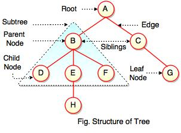

# Tree

## What is a Tree?

So far all of the data structures we have been looking at were linear data structures. A tree is a non-linear structure used to represent hierarchical data.

An example of hierarchical data commonly arranged in a tree is the family tree.



As seen above the tree is made of nodes. A parent is a node which has a descendent, or child. The root is the origin, or top of the structure, and leaves are childless nodes.

<!-- ## What is the Big O of Tree operations? -->

## Trees in Python

To create a tree in python we will first need a Node class. For this example we will be creating a binary tree, which means that each parent can have at most two children.

<span style="color: green">#Creating the Node class</span>

```python
class Node(object):
    def __init__(self):
        self.left = None
        self.right = None
        self.data = None
```

### Creating a Tree ----

### Tree Functions ----

-[Link Back to Welcome](0-welcome.md)
